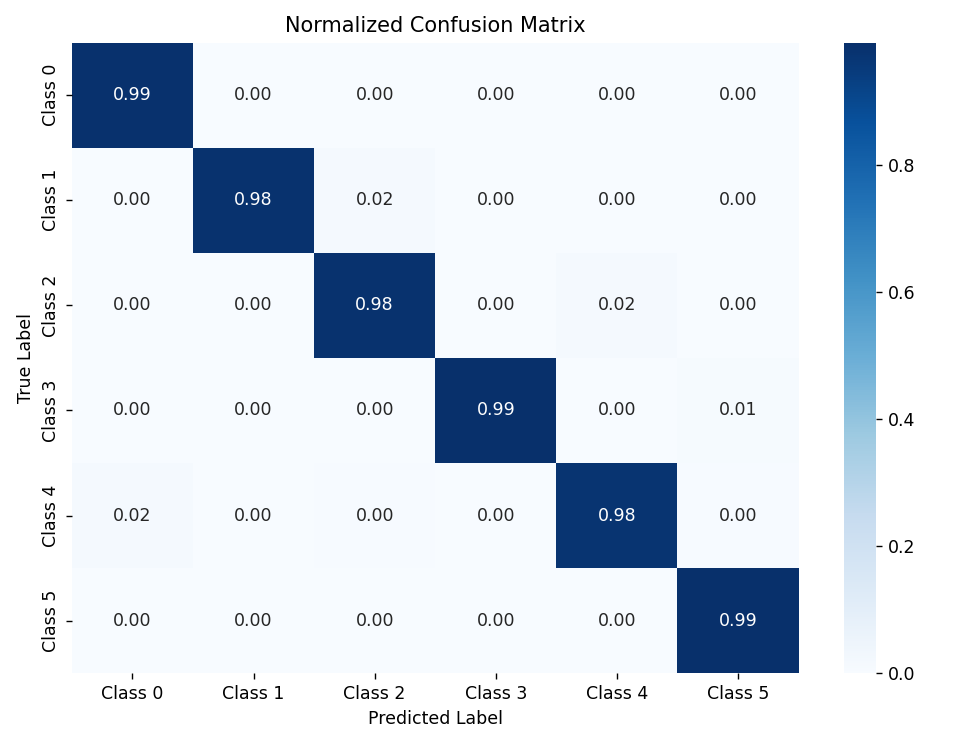
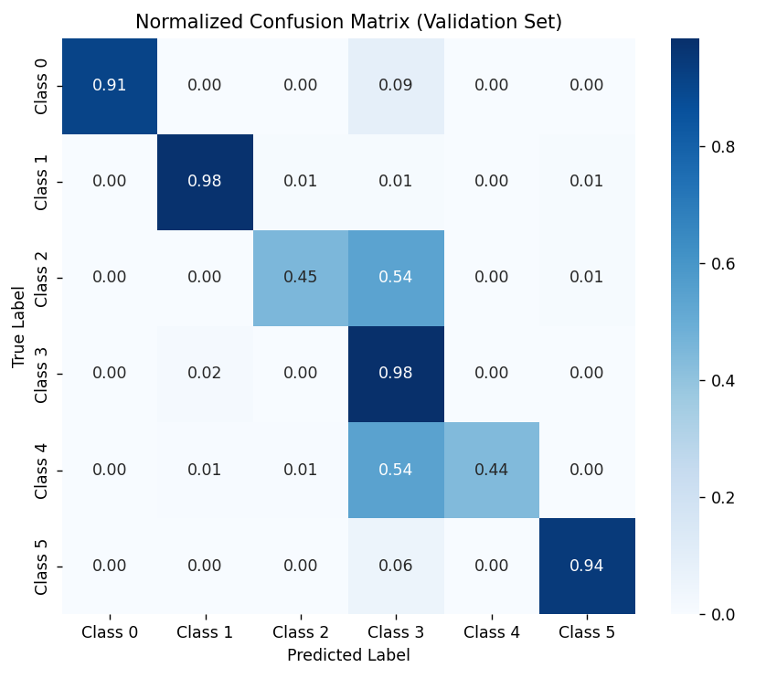
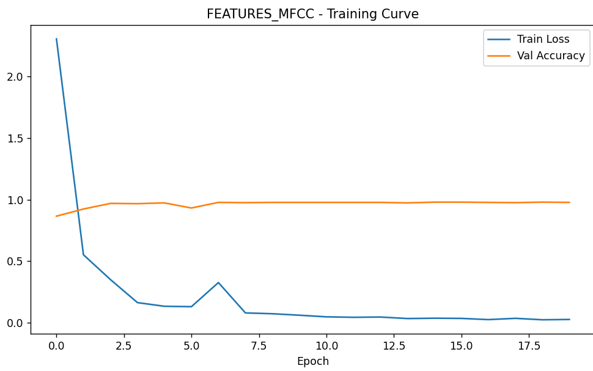
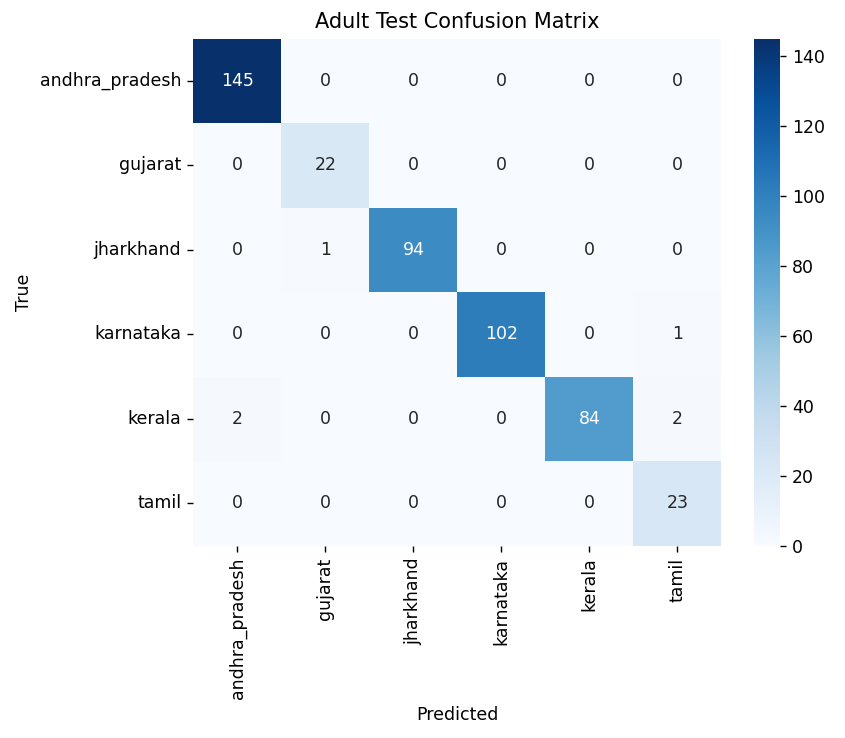
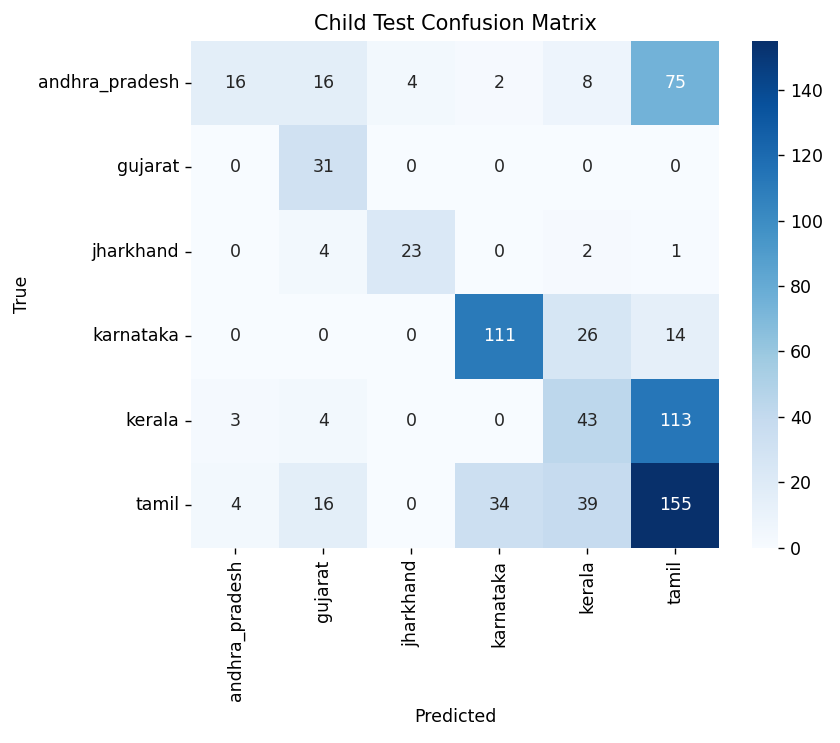
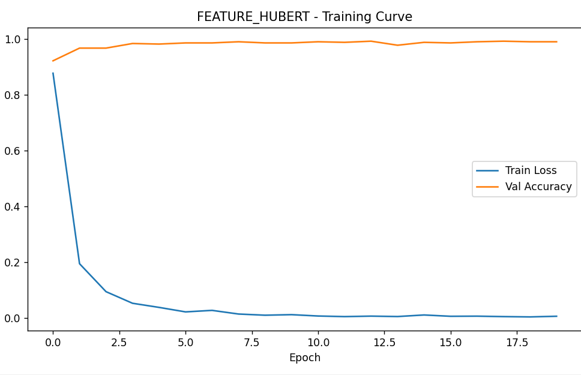
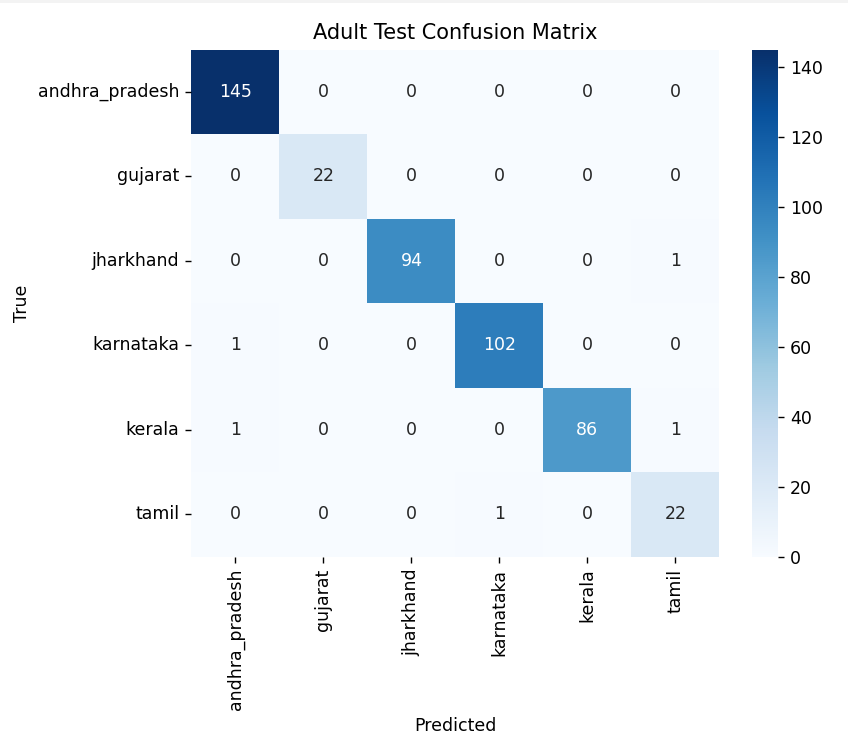
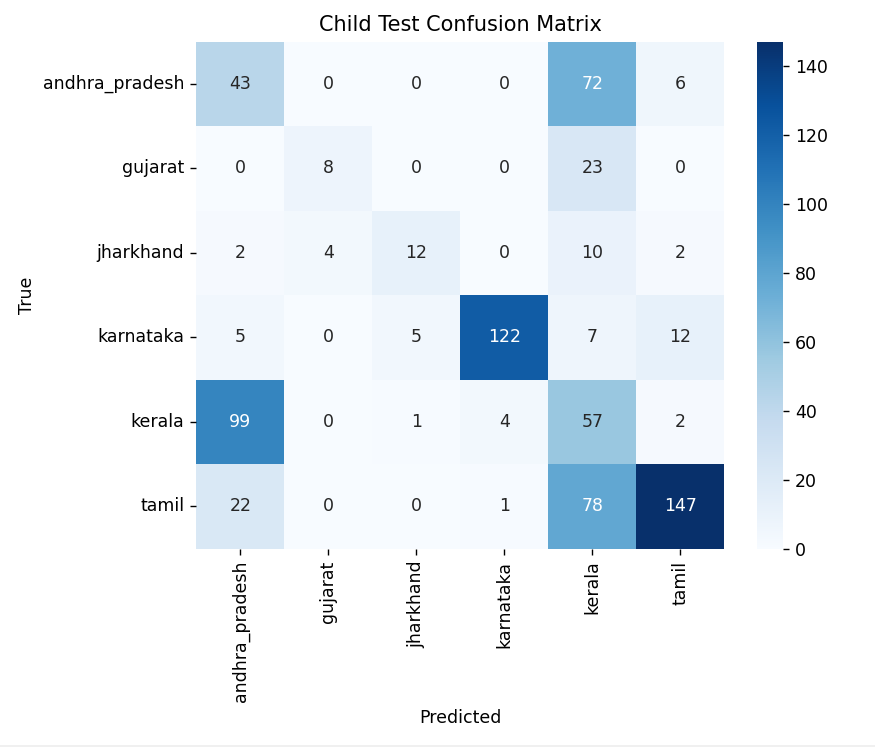

#  Native Language Identification of Indian English Speakers Using HuBERT

This project leverages **HuBERT (Hidden Unit BERT)** to identify the **native language (L1)** of Indian English speakers based on their speech characteristics.  
The model analyzes **acoustic patterns** from English utterances to detect subtle regional accent variations across Indian states.  
It contributes to building **accent-aware AI systems**, enhancing **speech recognition**, **speaker profiling**, and **voice adaptation** in multilingual contexts.
##  Objective

The primary objective of this project is to develop a system that can identify the **native language (L1)** of Indian English speakers by analyzing the **accent patterns** present in their speech.

The project focuses on building and evaluating a **Native Language Identification (NLI)** model that classifies a speaker’s native language from their English speech using both:
- **Traditional acoustic features** (MFCCs)
- **Self-supervised speech representations** (HuBERT embeddings)

Additionally, the study investigates the model’s ability to:
- **Generalize across age groups** (training on adults, testing on children)
- **Handle different linguistic levels** (word-level vs. sentence-level)

Finally, the project demonstrates a **real-world application** of accent detection, where the identified accent helps **personalize restaurant recommendations** based on regional preferences.

##  1. Develop a Native Language Identification Model

###  Goal
Build and evaluate a classifier that predicts an Indian speaker’s **native language (L1)** from English speech.  
The project compares **traditional acoustic features (MFCCs)** with **self-supervised HuBERT embeddings**, explores multiple neural architectures, and performs a **layer-wise analysis** to identify which HuBERT layer best encodes accent cues.

---

###  Pipeline Overview
1. **Dataset:** `IndicAccentDB_16k` — audio samples (train / val / test) across six Indian languages:
   - Andhra Pradesh, Gujarat, Jharkhand, Karnataka, Kerala, Tamil Nadu
2. **Feature Extraction**
   - **MFCCs:** Standard 40 coefficients (+Δ, ΔΔ as needed)
   - **HuBERT embeddings:** Extracted 13 hidden layers (Layer 0–12) using `facebook/hubert-base-ls960`
3. **Model Architectures**
   - **CNNs:** 1D/2D variants for MFCCs and HuBERT feature maps  
   - **BiLSTM:** Sequence modeling on frame-wise embeddings  
   - **Transformer-based classifier:** Self-attention across embeddings
4. **Training & Validation**
   - Batch normalization, dropout, and early stopping  
   - Hyperparameter tuning (batch size, LR, optimizer, network depth)
   - Layer-wise probing: identical classifier trained on each HuBERT layer to locate accent-relevant layers
5. **Evaluation Metrics**
   - Accuracy, Precision, Recall, F1-score per class  
   - Macro/Weighted averages and confusion matrix visualization  
   - Cross-comparison: **MFCC vs HuBERT**

---

###  Model Development & Training

####  HuBERT-Based Model (Self-Supervised Representations)

**Architecture**
- Used **HuBERT Base (facebook/hubert-base-ls960)** to extract 768-dim embeddings per sample.
- Integrated a **Domain-Adversarial Neural Network (DANN)** for domain-invariant accent classification.
- **Encoder + Classifier + Gradient Reversal Layer (GRL)** framework.
- Domain labels were **pseudo-generated** with **KMeans (k=4)** clusters to simulate accent sub-domains.

**Training Configuration**
| Parameter | Value |
|------------|--------|
| Batch Size | 64 |
| Epochs | 30 |
| Learning Rate | 2e-4 |
| Optimizer | AdamW |
| Scheduler | CosineAnnealingLR |
| Input Dim | 768 |
| Hidden Dim | 512 |
| Classes | 6 |
| Domains | 4 |
| Device | CUDA (if available) |

**Training Strategy**
- Used **GRL** to reverse gradients from the domain classifier, forcing feature invariance.  
- Combined classification and domain losses:  
- Dynamic λ schedule:  
**Performance Summary**
- Training Duration: ~30 epochs  
- Final Test Accuracy: **98.69%**  
- Macro F1-score: **0.9855**  
- Checkpoint: `accent_dann_model.pt`

---

####  MFCC-Based Model (Traditional Acoustic Features)

**Architecture**
- 3-layer **CNN** (Conv → BatchNorm → ReLU → MaxPool → Dense)  
- Input: 40 MFCC coefficients per frame (16kHz sampling)  

**Training Configuration**
| Parameter | Value |
|------------|--------|
| Batch Size | 64 |
| Epochs | 25 |
| Learning Rate | 1e-3 |
| Optimizer | Adam |
| Loss Function | CrossEntropyLoss |
| Device | CUDA / CPU |
| Classes | 6 |

**Performance Summary**
- Model Checkpoint: `mfcc_baseline_model.pt`
- Validation stabilized around epoch 20  
- Final Test Accuracy: **73.74%**

---

###  Final Classification Reports

#### HuBERT
| Class | Precision | Recall | F1-Score | Support |
|------:|:---------:|:------:|:--------:|--------:|
| 0 | 0.9850 | 0.9887 | 0.9869 | 266 |
| 1 | 0.9811 | 0.9811 | 0.9811 | 53 |
| 2 | 0.9762 | 0.9840 | 0.9801 | 125 |
| 3 | 0.9960 | 0.9921 | 0.9941 | 254 |
| 4 | 0.9879 | 0.9761 | 0.9820 | 251 |
| 5 | 0.9853 | 0.9926 | 0.9890 | 271 |

**Accuracy:** 98.69%  
**Macro Avg F1:** 0.9855 | **Weighted Avg F1:** 0.9869

---

#### MFCC
| Class | Precision | Recall | F1-Score | Support |
|------:|:---------:|:------:|:--------:|--------:|
| 0 | 1.0000 | 0.9091 | 0.9524 | 44 |
| 1 | 0.9528 | 0.9758 | 0.9641 | 124 |
| 2 | 0.9744 | 0.4524 | 0.6179 | 252 |
| 3 | 0.4457 | 0.9840 | 0.6135 | 250 |
| 4 | 1.0000 | 0.4384 | 0.6096 | 276 |
| 5 | 0.9845 | 0.9442 | 0.9639 | 269 |

**Accuracy:** 73.74% 
**Macro Avg F1:** 0.7869 | **Weighted Avg F1:** 0.7392

---

###  HuBERT Layer-wise Performance

| Layer | Val Acc | Test Acc |
|:------:|:-------:|:--------:|
| 00 | 0.9963 | 0.9914 |
| 01 | 0.9975 | 0.9951 |
| 02 | 0.9963 | **1.0000** |
| 03 | 0.9951 | 0.9975 |
| 04 | 0.9963 | 0.9963 |
| 05 | 0.9938 | 0.9901 |
| 06 | 0.9951 | 0.9877 |
| 07 | 0.9975 | 0.9901 |
| 08 | 0.9889 | 0.9889 |
| 09 | 0.9926 | 0.9951 |
| 10 | 0.9926 | 0.9914 |
| 11 | 0.9951 | 0.9926 |
| 12 | 0.9914 | 0.9926 |


---
##  Confusion Matrix — HuBERT + DANN Model

The following figure shows the **confusion matrix** for the HuBERT-based Domain-Adversarial Neural Network (DANN) model.  
It demonstrates highly accurate and balanced predictions across all six Indian native language classes.

<p align="center">
  
  <br>
  <em>Figure 1: Confusion Matrix — HuBERT + DANN Accent Classification Model</em>
</p>

---

## Confusion Matrix — MFCC Baseline Model

This confusion matrix depicts the **MFCC-based CNN model** performance.  
Noticeable misclassifications appear between linguistically similar accents (e.g., Karnataka vs. Kerala), underscoring the limitations of handcrafted acoustic features compared to self-supervised embeddings.

<p align="center">
  
  <br>
  <em>Figure 2: Confusion Matrix — MFCC-Based Accent Classification Model</em>
</p>


###  Key Takeaways
- **HuBERT > MFCCs:** Self-supervised speech features outperform handcrafted features (98.7% vs 73.7%).  
- **Model architecture less critical:** Feature quality drives performance; even shallow classifiers perform well on HuBERT.  
- **MFCC baseline limitations:** Poor generalization and low recall for specific accents.

---
###   Dataset — IndicAccentDB_16k

####  Source
The dataset is derived from the original **IndicAccentDB**, a publicly available multilingual speech corpus designed for **Indian English accent research**.  
It contains recordings from native speakers of multiple Indian languages reading **English sentences**.

---

####  Preprocessing (IndicAccentDB → IndicAccentDB_16k)
To ensure uniform input for model training and feature extraction, the raw dataset was standardized into the **IndicAccentDB_16k** version with the following preprocessing pipeline:

| Step | Description |
|------|--------------|
| 1️ | **Downmixed to mono** — all stereo recordings were converted to single-channel audio |
| 2️ | **Resampled to 16 kHz** — consistent sample rate for MFCC and HuBERT pipelines |
| 3️ | **Structured splits** — separated into `train/`, `val/`, and `test/` folders organized by native language labels |

---

Each folder contains `.wav` files labeled according to the speaker’s native language.

---

####  Key Details
- Sampling rate: **16,000 Hz**
- Channels: **Mono**
- Languages: **6 (Andhra Pradesh, Gujarat, Jharkhand, Karnataka, Kerala, Tamil Nadu)**

---

 **IndicAccentDB_16k** is a *preprocessed internal dataset* used for this project.  

##  2. Generalization Across Age Groups

###  Objective

> Evaluate how well the model generalizes across age domains — trained on adult speech, then tested on children’s speech.

> This setup probes whether representations capture linguistic accent patterns rather than age-specific voice traits.


###  Experimental Setup

> **Dataset Note:** The `IndicAccentDB_age` dataset used in this experiment was derived from the [DarshanaS/IndicAccentDb](https://huggingface.co/datasets/DarshanaS/IndicAccentDb) dataset on Hugging Face. The original dataset was split into `adult` and `child` subsets by analyzing **fundamental frequency (f0)** and **pitch** to separate speakers.

### 1️ **Feature Extraction**

Two feature types were extracted from `IndicAccentDB_age`:
* **MFCC (40-D)** — Handcrafted acoustic descriptors using `librosa.feature.mfcc`.
* **HuBERT (768-D)** — Contextual speech embeddings from `facebook/hubert-base-ls960`.

Both pipelines process adult and child subsets into `.pt` feature tensors:

### 2 Model Training


A simple feed-forward neural network (AccentClassifier) was trained using **adult speech only**:

* **Train:** `IndicAccentDB_age/adult/train`
* **Validation:** `IndicAccentDB_age/adult/val`
* **Test (Adult):** `IndicAccentDB_age/adult/test`
* **Test (Child):** `IndicAccentDB_age/child/test`
* **Optimizer:** Adam (lr = 1e-3)
* **Loss:** CrossEntropyLoss
* **Epochs:** 10
* **Batch size:** 32

###  Evaluation Metrics

Performance is measured using **accuracy, precision, recall, and F1-score** for both adult and child test splits.
###  Model Training

A simple feed-forward neural network (AccentClassifier) was trained using **adult speech only**:

| Split | Path |
| :--- | :--- |
| **Train** | `IndicAccentDB_age/adult/train` |
| **Validation** | `IndicAccentDB_age/adult/val` |
| **Test (Adult)** | `IndicAccentDB_age/adult/test` |
| **Test (Child)** | `IndicAccentDB_age/child/test` |

**Training Configuration:**

* **Optimizer:** Adam (lr = 1e-3)
* **Loss:** CrossEntropyLoss
* **Epochs:** 10
* **Batch size:** 32

###  Evaluation Metrics

Performance was measured using **accuracy, precision, recall, and F1-score** for both adult and child test splits.


###  Results Summary

| Feature | Adult Accuracy | Child Accuracy |
| :--- | :---: | :---: |
| **MFCC** | 0.987 | 0.509 |
| **HuBERT** | 0.989 | 0.523 |

---

###  MFCC-Based Model

#### Adult Test Results

**Accuracy: 0.9874**

| Accent | Precision | Recall | F1-score |
| :--- | :---: | :---: | :---: |
| andhra_pradesh | 0.99 | 1.00 | 0.99 |
| gujarat | 0.96 | 1.00 | 0.98 |
| jharkhand | 1.00 | 0.99 | 0.99 |
| karnataka | 1.00 | 0.99 | 1.00 |
| kerala | 1.00 | 0.95 | 0.98 |
| tamil | 0.88 | 1.00 | 0.94 |

#### Child Test Results

**Accuracy: 0.5094**

| Accent | Precision | Recall | F1-score |
| :--- | :---: | :---: | :---: |
| andhra_pradesh | 0.70 | 0.13 | 0.22 |
| gujarat | 0.44 | 1.00 | 0.61 |
| jharkhand | 0.85 | 0.77 | 0.81 |
| karnataka | 0.76 | 0.74 | 0.74 |
| kerala | 0.36 | 0.26 | 0.31 |
| tamil | 0.43 | 0.62 | 0.51 |

---

###  Visualizations

<table>
  <tr>
    <td align="center">
      
      <br>
      <em>Figure 1: Training Accuracy vs. Epoch</em>
    </td>
    <td align="center">
      
      <br>
      <em>Figure 2: MFCC Model — Adult Test Confusion Matrix</em>
    </td>
    <td align="center">
      
      <br>
      <em>Figure 3: MFCC Model — Child Test Confusion Matrix</em>
    </td>
  </tr>
</table>

---

###  HuBERT-Based Model

#### Adult Test Results

**Accuracy: 0.9895**

| Accent | Precision | Recall | F1-score |
| :--- | :---: | :---: | :---: |
| andhra_pradesh | 0.99 | 1.00 | 0.99 |
| gujarat | 1.00 | 1.00 | 1.00 |
| jharkhand | 1.00 | 0.99 | 0.99 |
| karnataka | 0.99 | 0.99 | 0.99 |
| kerala | 1.00 | 0.98 | 0.99 |
| tamil | 0.92 | 0.96 | 0.94 |

#### Child Test Results

**Accuracy: 0.5228**

| Accent | Precision | Recall | F1-score |
| :--- | :---: | :---: | :---: |
| andhra_pradesh | 0.25 | 0.36 | 0.29 |
| gujarat | 0.67 | 0.26 | 0.37 |
| jharkhand | 0.67 | 0.40 | 0.50 |
| karnataka | 0.96 | 0.81 | 0.88 |
| kerala | 0.23 | 0.35 | 0.28 |
| tamil | 0.87 | 0.59 | 0.71 |

---

###  Visualizations (HuBERT Model)

<table>
  <tr>
    <td align="center">
      
      <br>
      <em>Figure 1: HuBERT Training Accuracy vs. Epoch</em>
    </td>
    <td align="center">
      
      <br>
      <em>Figure 2: HuBERT Model — Adult Test Confusion Matrix</em>
    </td>
    <td align="center">
      
      <br>
      <em>Figure 3: HuBERT Model — Child Test Confusion Matrix</em>
    </td>
  </tr>
</table>


#  Accent-Aware Cuisine Recommendation — Model & Demo

**One-line:** Real-time accent detection (HuBERT → DANN) that infers regional background and surfaces culturally-relevant cuisine recommendations.


**Watch the demo video:**
https://your-hosted-video-link.com/demo.mp4


---

##  Model (concise)

* **Encoder:** `Linear(768 → 512)` + `BatchNorm` + `ReLU` + `Dropout`
* **Label classifier:** `512 → 256 → N_classes` (softmax cross-entropy)
* **Domain discriminator:** `(GRL) 512 → 256 → N_domains` (softmax cross-entropy)
* **Adversarial:** Gradient Reversal Layer (GRL) with scheduled λ (DANN-style)
* **Objective:** $L = L_{class} + \alpha \times L_{domain}$ (α = domain loss weight, default 0.5)

---

##  Training config (use these exact defaults)

| Parameter | Value |
| :--- | :--- |
| **device** | `cuda`\|`cpu` |
| **input_dim** | `768` (HuBERT embedding dim) |
| **hidden_dim** | `512` |
| **num_classes** | `<your num accent classes>` |
| **n_domains** | `4` (pseudo-domain clusters) |
| **batch_size** | `64` |
| **epochs** | `30` |
| **lr** | `2e-4` |
| **optimizer** | `AdamW` (weight_decay=1e-5) |
| **scheduler** | `CosineAnnealingLR(T_max=epochs)` |
| **class_imbalance** | `WeightedRandomSampler` |
| **domain_loss_weight**| `0.5` |
| **grl_schedule** | $\lambda = \frac{2}{1 + \exp(-10 \times p)} - 1$ (p = epoch/max_epoch) |
| **seed** | `42` |


# Run the Web App (Accent-Aware Cuisine Recommendation System)

### 1. Clone the Repository

```bash
git clone [https://github.com/savioshaju/IIIT-H-.git](https://github.com/savioshaju/IIIT-H-.git)
cd IIIT-H-
```
### 2. Environment Setup (Python 3.10 Recommended)

To avoid dependency conflicts, use a fresh Python 3.10 environment.

**Create & activate a virtual environment**

```bash
# Windows
python -m venv venv
venv\Scripts\activate

# macOS/Linux
python3 -m venv venv
source venv/bin/activate
```
**Verify Python version**

```bash
python --version
# Should output: Python 3.10.x
```
### 3. Install Requirements

Move into the `webapp` folder and install dependencies:

```bash
cd webapp
pip install -r requirements.txt
```
⚠️ If you hit version conflicts or missing libs, delete `venv` and re-create using Python 3.10.

### 4. Install Required System Packages

Your model and audio pipeline use HuBERT feature extraction — you’ll need these:

```bash
# Windows
choco install ffmpeg

# Ubuntu / Debian
sudo apt update
sudo apt install ffmpeg libsndfile1

# macOS
brew install ffmpeg libsndfile
```
**Verify installations:**

```bash
ffmpeg -version
python -c "import soundfile; print('libsndfile ok')"
```
### 5. Run the Web Application

Once everything is installed, launch the web app backend:

```bash
python app.py
```
You should see:

`Running on http://127.0.0.1:5000/ (Press CTRL+C to quit)`


### 6. Open in Browser

Navigate to:

`http://127.0.0.1:5000`

You’ll get the main interface where users can:

* Record or upload an English phrase.
* System detects accent → infers region → shows top cuisine recommendations.
